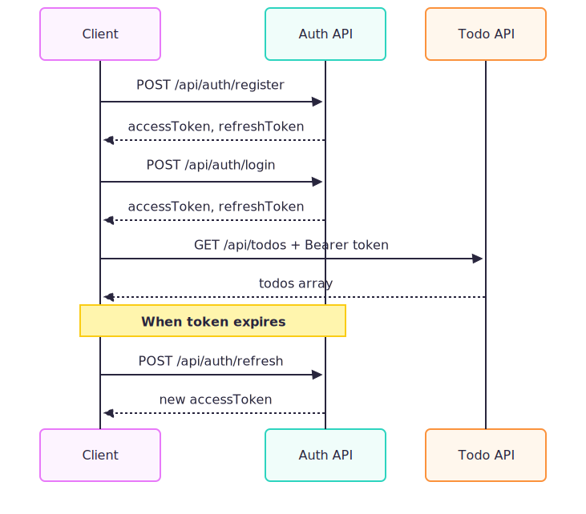

# Todo API

[](https://github.com/abdullah-hamada7/ToDoApp-SpringBoot/actions)
[](https://codecov.io/gh/abdullah-hamada7/ToDoApp-SpringBoot)
[](https://openjdk.org/)
[](https://spring.io/projects/spring-boot)

RESTful Todo API with JWT authentication, PostgreSQL and Redis.

## Architecture



## Features

| Feature | Description |
| ------- | ----------- |
| JWT Auth | Access and refresh tokens |
| Multi-Tenancy | Users only see their own todos |
| PostgreSQL | Persistent storage |
| Redis | Caching layer |
| Docker | Compose with PostgreSQL, Redis |
| CI/CD | GitHub Actions pipeline |
| OpenAPI | Swagger UI docs |
| RBAC | USER and ADMIN roles |

## Tech Stack

- Spring Boot 3.4.0
- Spring Security + JWT
- PostgreSQL 16
- Redis 7
- JUnit 5, Mockito, TestContainers
- Maven
- Docker

## Quick Start

### Development (H2)

```bash
git clone https://github.com/abdullah-hamada7/ToDoApp-SpringBoot.git
cd ToDoApp-SpringBoot
./mvnw spring-boot:run -Dspring-boot.run.profiles=dev
```

### Docker (PostgreSQL + Redis)

```bash
docker compose up -d
docker compose logs -f app
```

### URLs

| Service | URL |
| ------- | --- |
| API | <http://localhost:8080> |
| Swagger UI | <http://localhost:8080/swagger-ui.html> |
| H2 Console (dev) | <http://localhost:8080/h2-console> |
| pgAdmin | <http://localhost:5050> |

## API Endpoints

### Authentication

| Method | Endpoint | Description |
| ------ | -------- | ----------- |
| POST | `/api/auth/register` | Register user |
| POST | `/api/auth/login` | Get tokens |
| POST | `/api/auth/refresh` | Refresh token |

### Todos (Auth Required)

| Method | Endpoint | Description | Roles |
| ------ | -------- | ----------- | ----- |
| GET | `/api/todos` | List todos | USER, ADMIN |
| GET | `/api/todos/{id}` | Get todo | USER, ADMIN |
| POST | `/api/todos` | Create todo | USER, ADMIN |
| PUT | `/api/todos/{id}` | Update todo | USER, ADMIN |
| PATCH | `/api/todos/{id}` | Partial update | USER, ADMIN |
| DELETE | `/api/todos/{id}` | Delete todo | ADMIN |

## Auth Flow


## Usage

### Register

```bash
curl -X POST http://localhost:8080/api/auth/register \
  -H "Content-Type: application/json" \
  -d '{"username": "john", "password": "password123"}'
```

### Login

```bash
curl -X POST http://localhost:8080/api/auth/login \
  -H "Content-Type: application/json" \
  -d '{"username": "john", "password": "password123"}'
```

### Create Todo

```bash
curl -X POST http://localhost:8080/api/todos \
  -H "Authorization: Bearer <token>" \
  -H "Content-Type: application/json" \
  -d '{"title": "Buy groceries"}'
```

### List Todos

```bash
curl http://localhost:8080/api/todos \
  -H "Authorization: Bearer <token>"
```

## Testing

```bash
./mvnw test
./mvnw test jacoco:report
```

## Project Structure

```
src/main/java/com/abdullah/todo/
├── config/        # Security, OpenAPI config
├── controller/    # REST controllers
├── dto/           # Request/Response objects
├── entity/        # JPA entities
├── exception/     # Exception handling
├── mapper/        # Entity-DTO mappers
├── repository/    # Data access
├── security/      # JWT service, filter
└── service/       # Business logic
```

## Security

- BCrypt password hashing
- HMAC-SHA384 JWT signing
- 15 min access token expiry
- 7 day refresh token expiry
- Role-based access control
